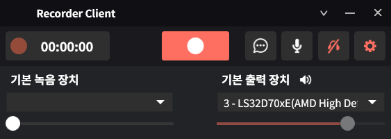

# 🎧 Recorder Client

금융권 상담 녹취를 위한 **C# 기반 Windows 데스크톱 녹취 프로그램**입니다.  
마이크 입력부터 파일 저장, 서버 전송까지 **녹취 전체 흐름을 설계·구현**했습니다.

## 📸 Screenshots

### 메인 화면


### 프로그램 워크플로우


---

## 📌 프로젝트 개요

- **프로젝트 유형**: 금융권 내부 사용 녹취 클라이언트
- **개발 형태**: 단독 개발
- **플랫폼**: Windows Desktop
- **주요 역할**
  - 오디오 녹취 로직 설계 및 구현
  - 오디오 장치 관리
  - 파일 저장 및 전송 구조 구현
  - 실시간 상태 모니터링 UI 구현

> 단순 녹음 기능이 아닌  
> **실무 환경에서 장시간 안정적으로 동작하는 녹취 프로그램**을 목표로 개발했습니다.

---

## 🎯 주요 기능

### 🎙 오디오 녹취
- 실시간 마이크 입력 캡처
- WAV / MP3 포맷 저장
- 스테레오 입력 시 **좌 / 우 채널 분리 저장**
- 녹취 시작 / 일시정지 / 중지 제어

### 🎛 오디오 장치 관리
- 다중 입력 장치 목록 조회
- 실행 중 장치 변경 대응
- 기본 오디오 장치 변경 감지

### 📊 실시간 상태 모니터링
- 입력 음성 파형 시각화
- 녹취 상태 표시 (Recording / Pause / Stop)
- 녹취 시간 타이머 관리

### 🌐 엔진 서버 연동 (TCP messageSend)
- 녹취 중 수신되는 PCM 버퍼를 프레임 단위로 패킷화하여 엔진 서버로 TCP 전송
- 엔진 서버에서 실시간 처리(분석/저장/후처리 등)를 수행하도록 역할 분리
- 전송 실패 시 로그 기록 및 정책(중단/재시도/재연결) 적용 가능

---

## 🧩 시스템 처리 흐름

``````
[ Audio Input Device ]
        ↓
[ NAudio Capture ]
        ↓
[ PCM Buffer Processing ]
        ↓
[ Channel Split / Encoding ]
        ↓
[ File Save (WAV / MP3) ]
        ↓
[ Server Upload (Optional) ]

🔧 핵심 구현 포인트
1️⃣ 안정적인 오디오 캡처
 - NAudio (WaveInEvent) 기반 실시간 캡처
 - 버퍼 단위 데이터 수신 (OnDataAvailable)
 - UI 스레드와 녹취 처리 스레드 분리
 - UI Thread      : 화면 상태 표시
 - Audio Thread  : 녹취 / 파일 처리
→ 장시간 녹취 시에도 UI 멈춤 없이 동작

2️⃣ 좌 / 우 채널 분리 처리
 - 스테레오 PCM 데이터에서 바이트 단위로 L / R 채널 분리
 - 채널별 독립 파일 저장 가능
 - [L][R][L][R] → Left.wav / Right.wav
→ 금융권 녹취 환경의 채널 단위 관리 요구사항 대응

3️⃣ 파일 저장 안정성
 - 녹취 중 예외 발생 대비
 - 스트림 기반 파일 쓰기
 - 녹취 종료 시 헤더 정합성 보장

4️⃣ UI / 로직 분리 구조
 - WPF 기반 UI 구성
 - 오디오 / 장치 / 네트워크 로직 분리
 - 상태 변경은 Dispatcher를 통해 UI 반영

🛠 기술 스택
 - Language: C#
 - Framework: .NET / WPF
 - Audio Library: NAudio
 - File Format: WAV / MP3
 - OS: Windows

📂 프로젝트 구조 (요약)
voicelog-client
├─ src/
│   ├─ Audio/
│   │   ├─ Recorder.cs
│   │   ├─ ChannelSplitter.cs
│   │   └─ AudioEncoder.cs
│   │
│   ├─ Device/
│   │   └─ AudioDeviceManager.cs
│   │
│   ├─ Network/
│   │   └─ UploadClient.cs
│   │
│   ├─ UI/
│   │   ├─ MainWindow.xaml
│   │   └─ ViewModels/
│   │
│   └─ Common/
│       └─ Logger.cs
│
├─ assets/
│   └─ screenshot.png
└─ README.md

⚠️ 문제 상황 & 해결 경험
 - 장시간 녹취 시 UI 멈춤 현상
원인: UI 스레드에서 녹취 처리
해결: 녹취 로직을 별도 스레드로 분리

 -  스테레오 녹취 시 채널 데이터 꼬임
원인: PCM 바이트 처리 순서 오류
해결: 프레임 단위 좌 / 우 명확 분리

 -  녹취 중 예외 발생 시 파일 손상
해결: 스트림 종료 시점 제어 및 예외 처리 강화

✍️ 배운 점
 - 오디오 처리는 정확성과 안정성이 최우선
 - UI / 로직 분리는 유지보수성과 직결
 - “녹음된다”보다 **“운영 환경에서 버틴다”**가 중요

📌 요약

금융권 환경에서 사용되는
C# 기반 데스크톱 녹취 프로그램을 설계·구현한 프로젝트
